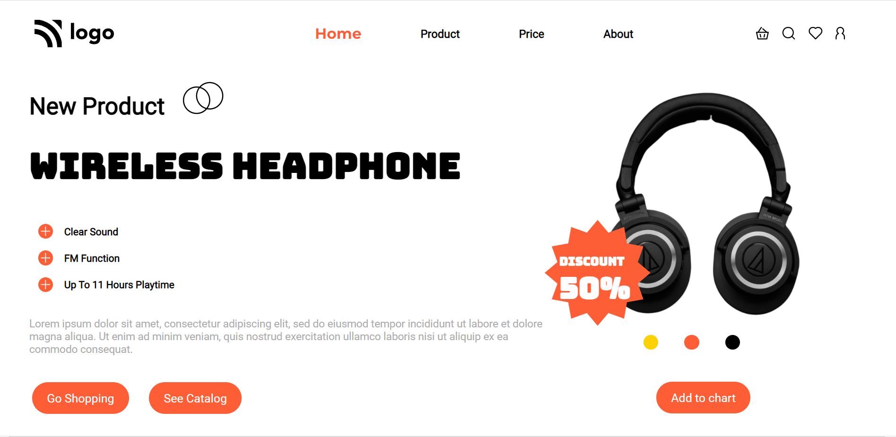

# Project 07 - HTML and CSS

By Piyush Bhatt

Deployed link of website &nbsp; 

 

# [Link to Project 07](service-project4.netlify.app)

 

# Preview of the Project.

 

## What I learnt in this Project?

- I learned how to place **icon** in a particular position.
- I also learnt about how to make beautiful **buttons**.
- I also learnt more about **align items in flexbox**.

  

# Time Taken to complete  this project is 6 hour.